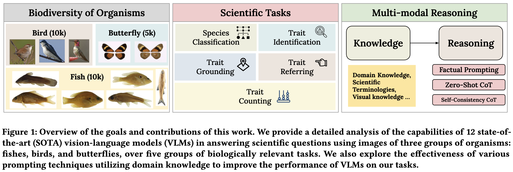
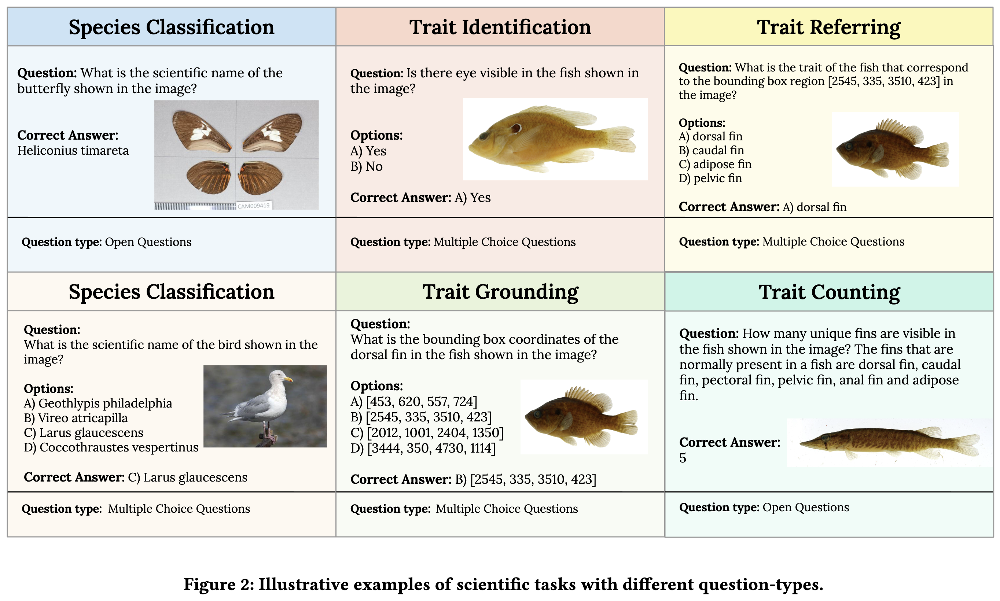
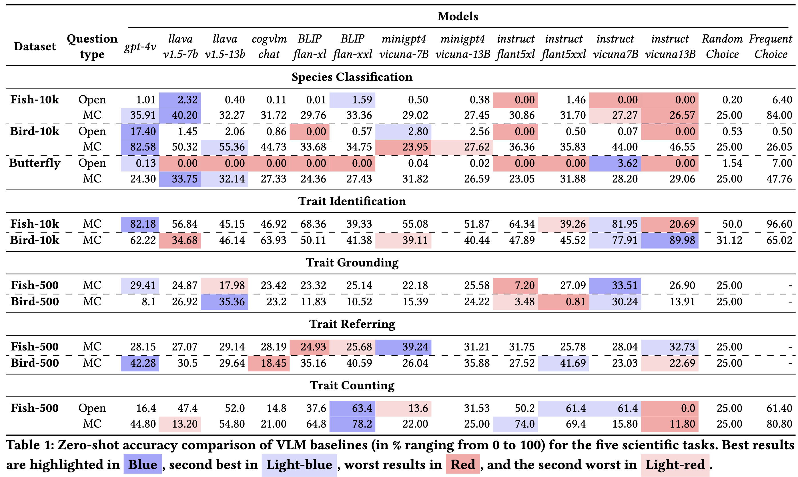

# VLM4Bio

This repo contains the full pipeline and evaluation code for the paper "On the Zero-Shot Effectiveness of Pre-trained Vision-Language Models (VLMs) for Understanding Scientific Images: A Case Study in Organismal Biology"



## Abstract
With the proliferation of imaging technologies in almost every field of science, there is a growing deluge of scientific images that are being collected and made publicly accessible in a variety of disciplines. For example, in organismal biology, images are increasingly becoming the currency for documenting biodiversity on the planet, e.g., through images collected by scientists or captured by drones, camera traps, or citizen scientists.  This growth in scientific images provides a unique tipping point for accelerating discoveries in disciplines such as organismal biology that are reliant on expert visual attention to extract biological information (or traits) to understand the evolution and function of organisms.
With the advent of large foundation models such as vision-language models (VLMs) in mainstream applications of computer vision, it is pertinent to ask if pre-trained VLMs contain the necessary knowledge to aid scientists in answering biologically relevant questions without any additional fine-tuning on scientific datasets. However, unlike mainstream tasks in computer vision, understanding scientific images requires knowledge of domain-specific  terminologies  and reasoning that are not fully represented in conventional image datasets used for training VLMs. In this paper, we evaluate the effectiveness of 12 state-of-the-art (SOTA) VLMs on five scientifically relevant tasks in the field of organismal biology to study biodiversity science. To perform this evaluation, we have created a novel dataset of $~454K$ question-answer pairs based on $25k$ images of three  groups of organisms: fishes, birds, and butterflies. We also explore the effectiveness of different prompting techniques in improving the performance of VLMs on our dataset. Our analysis sheds new light on the capabilities of current standards of pre-trained VLMs in answering scientific questions involving images, prompting new research directions in this area.


## Tasks

We conducted our evaluation on five scientific tasks relevant to biologists in the study of biodiversity science. Tasks are: Species Classification, Trait Identification, Trait Grounding, Trait Referring, Trait Counting.

## Datasets
| Statistics | Number | Statistics | Number |
|----------|----------|----------|----------|
| **Fish-10k**| | **Fish-500** | |
|Images | 10,347 | Images | 500 |
|Species | 495 | Species | 60 | 
| **Bird-10k** | |**Bird-500** | |
|Images | 11,092 | Images | 492 |
|Species | 188 | Species | 47 |
| **Butterfly** | | | |
|Images | 4,972 |  | | |
|Species | 65 | | | |

We used image collections of three taxonomic groups of organisms: Fish (contained 10k images), Bird (containing 10k images), and Butterfly (containing 5k images), obtained by taking subsets of the FishAIR dataset, the CUB dataset, and the Cambridge Butterfly dataset, respectively. The motivation for choosing these datasets is to evaluate the effectiveness of VLMs in answering biological questions over a range of bio-diverse organisms.
The dataset-500 variations contain trait-level bounding box annotations and are used for grounding, referring, and counting tasks.

## Evaluation



## Setting up Environments
We used multiple environments to run the VLMs. One should follow the setting up environment instructions of the VLM repositories to set up the environments.
| Environments | Models | Instruction |
|----------|----------|----------|
| llava | llava-v1.5-7b, llava-v1.5-13b, gpt-4v | [link](https://github.com/haotian-liu/LLaVA?tab=readme-ov-file#install) |
| vlm_env | cogvlm-chat | [link](https://github.com/THUDM/CogVLM?tab=readme-ov-file#option-2deploy-cogvlm--cogagent-by-yourself) |
| minigptv | minigpt4-vicuna-7B, minigpt4-vicuna-13B | [link](https://github.com/Vision-CAIR/MiniGPT-4?tab=readme-ov-file#installation)|
| blip | blip-flan-xl, blip-flan-xxl | [link](https://github.com/salesforce/BLIP?tab=readme-ov-file#blip-bootstrapping-language-image-pre-training-for-unified-vision-language-understanding-and-generation) |
| instruct_blip | instruct-vicuna7b, instruct-vicuna13b, instruct-flant5xl, instruct-flant5xxl | [link](https://github.com/salesforce/LAVIS/blob/main/projects/instructblip/README.md#install-from-source) |

You may need to additionally install ```imageio, openai, jsonlines``` depending on the environment. 

### Running GPT-4V(ision)
If you want to evaluate the performance of the GPT-4V model. You need to provide your Openai API keys in ```gpt_api/api_key.txt``` and ```gpt_api/org_key.txt```.

## Download Datasets
The datasets can be downloaded from this [repository](https://osf.io/k2sp9/): 

[Fish](https://osf.io/k2sp9/files/osfstorage/65cd520cb018b60150213451), 
[Bird](https://osf.io/k2sp9/files/osfstorage/65cd5205b74cac0161836e87), 
[Butterfly](https://osf.io/k2sp9/files/osfstorage/65cd51dc6d0cb8015c1a9624)

Download the .zip files, unzip them, and order the files like the following in the ```datasets/``` folder.

```
datasets/
├── Fish/
│   ├── images/
│   │   ├── INHS_FISH_58870.jpg
│   │   ├── INHS_FISH_58819.jpg
│   │   └── ...
│   └── metadata/
│       ├── metadata_10k.csv
│       ├── metadata_500.csv
│       └── ...
├── Bird/
│   ├── images/
│   │   ├── Ivory_Gull_0117_49227.jpg
│   │   ├── Yellow_Warbler_0026_176337.jpg
│   │   └── ...
│   └── metadata/
│       ├── bird_metadata_10k.csv
│       ├── identification.csv
│       └── ...
└── Butterfly/
    ├── images/
    │   ├── butterfly_train_heliconius_sara_0007.jpg
    │   ├── butterfly_val_pyrrhogyra_cramen_0001.jpg
    │   └── ...
    └── metadata/
        ├── metadata.csv
        └── imagelist.csv
```


## Evaluation Notebooks
The evaluation notebooks are stored in the ```Evaluation/``` folder.


## Citation


